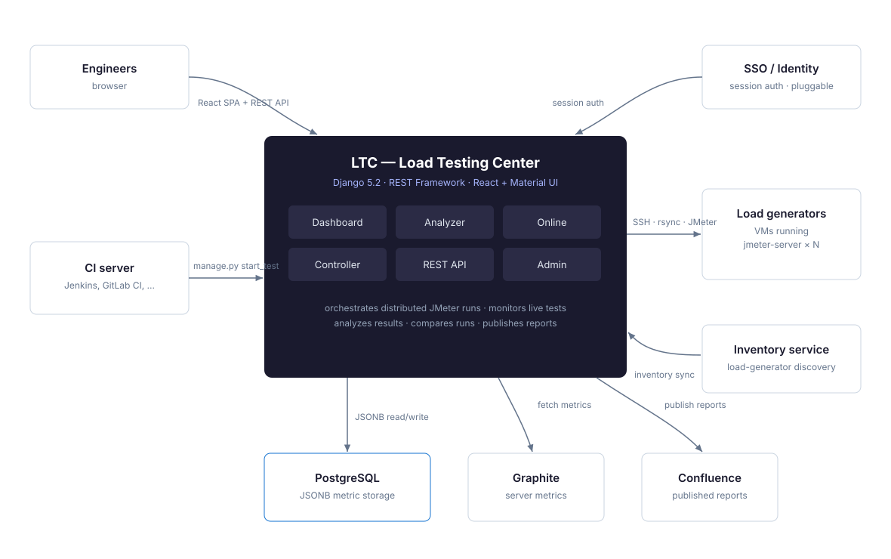
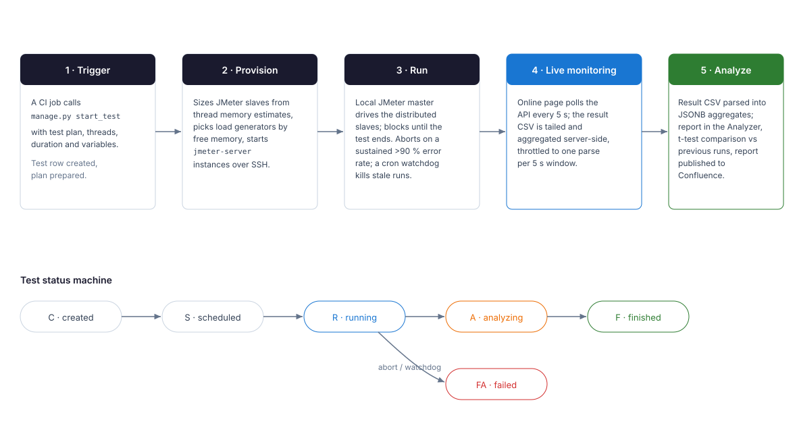
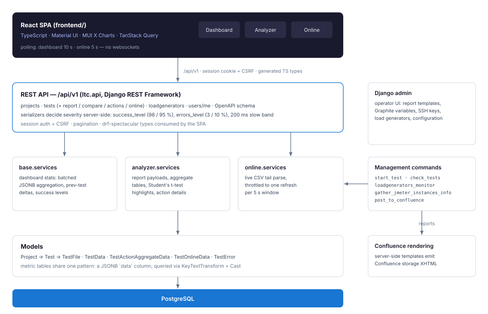
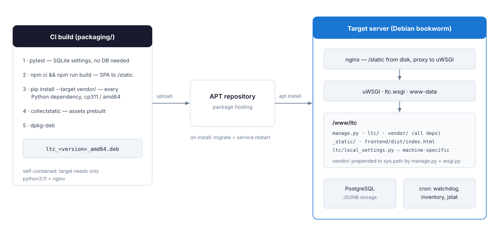

# LTC — Load Testing Center

A web application for **continuous load testing with [Apache JMeter](https://jmeter.apache.org/)**:
it provisions distributed JMeter runs across a fleet of load generators, monitors them live,
turns raw result files into comparable reports, and tells you whether the release you just
tested got faster or slower — automatically, on every run.



## What it does

| Module | Purpose |
|---|---|
| **Dashboard** | Fleet and test overview: recent runs with success rates and response-time deltas, currently running tests with progress, load-generator health. |
| **Analyzer** | Post-run reports: aggregate tables, response-time timelines, top errors and slowest actions, and statistical comparison against previous runs (Student's t-test highlights: what got slower, faster, or disappeared). |
| **Online** | Live monitoring of a running test — response times, error rate and throughput charts updating while JMeter is still firing. |
| **Controller** | Distributed-run orchestration: sizes JMeter server instances from memory estimates, picks load generators by free capacity, provisions and tears them down over SSH. |
| **Reporting** | Publishes rendered reports to Confluence after each run (optional). |
| **Admin** | Django admin as the operator UI: report templates, metric variables, SSH keys, configuration. |

## How a test run works



A CI job (Jenkins, GitLab CI, cron — anything that can run a management command) starts a test:

```bash
python manage.py start_test \
    --jmeter_path "$JMETER_HOME" --temp_path /tmp/ltc \
    --testplan testplan.jmx --project my-service \
    --threads 100 --duration 3600 \
    --vars '[{"name": "THREAD_COUNT", "value": "100", "distributed": true}]'
```

The command blocks for the duration of the run, then analyzes the results and publishes the
report. While it runs, the **Online** page shows the test live, and a cron watchdog
(`check_tests`) terminates runs that stop reporting.

## Architecture



- **Backend**: Django 5.2 + Django REST Framework. All UI data flows through `/api/v1`
  (OpenAPI schema at `/api/v1/schema/`, Swagger UI at `/api/v1/schema/swagger/`).
- **Frontend**: React + TypeScript single-page app (Vite, Material UI, MUI X Charts/DataGrid,
  TanStack Query). Live views poll — no websocket infrastructure to operate.
- **Storage**: PostgreSQL. Metric tables share one pattern — a JSONB `data` column holding
  per-minute or per-action aggregates, queried with native JSON expressions.
- **Presentation thresholds live server-side**: serializers emit severity levels
  (success 98/95 %, error bands 3/10 %, 200 ms slow-action mark); the SPA only maps levels
  to colors, so every consumer of the API gets the same verdicts.

## Getting started

Requirements: Python 3.11+, PostgreSQL, Node 20+ (for the frontend).

```bash
# Backend
python3 -m venv .venv && .venv/bin/pip install -r requirements.txt
cp ltc/local_settings.example.py ltc/local_settings.py   # point it at your PostgreSQL
.venv/bin/python manage.py migrate
.venv/bin/python manage.py runserver 8888

# Frontend (dev server on :5173, proxies the API to :8888)
cd frontend && npm install && npm run dev
```

Configuration is environment-variable driven (`LTC_*`); `ltc/local_settings.py` is an optional
override for machine-specific values. See `ltc/local_settings.example.py` for the full list —
database, allowed hosts, secret key, and the optional Graphite/Confluence/SSO integrations.

### Tests

```bash
.venv/bin/python -m pytest          # SQLite, runs anywhere
.venv/bin/python -m pytest --ds=ltc.settings   # against your PostgreSQL
```

## Deployment



LTC ships as a **self-contained Debian package**: all Python dependencies are vendored into
`/www/ltc/vendor`, the SPA and static assets are prebuilt at package time, and the target
server needs only `python3.11` and `nginx` in front of a WSGI server. On install, the package
runs migrations and restarts the app service.

```bash
bash packaging/build-deb.sh     # produces ltc_<version>_amd64.deb
```

See [packaging/README.md](packaging/README.md) for the CI step layout and target-server notes.

## Integrations (all optional)

- **Confluence** — rendered run reports published to a wiki space, driven by admin-editable
  report templates.
- **Graphite** — server metrics embedded into reports via template variables.
- **Inventory service** — automatic load-generator discovery
  (`loadgenerators_monitor` management command; adapt it to your inventory source).
- **SSO** — session authentication is pluggable via a Django auth backend; without one,
  standard Django auth is used.

## License

MIT — see [LICENSE](LICENSE). Started at [InnoGames](https://www.innogames.com); see [AUTHORS](AUTHORS).
